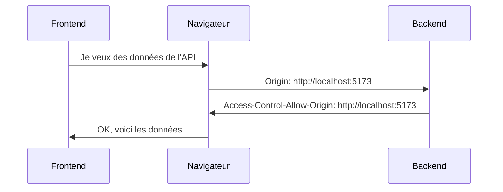

# Guide Complet du CORS pour Débutants

## 1. Qu'est-ce que le CORS ?

CORS signifie "Cross-Origin Resource Sharing" (Partage de Ressources entre Origines Différentes). Pour comprendre le CORS, décomposons d'abord quelques termes essentiels :

### Termes de Base

#### Origine (Origin)
Une "origine" est composée de 3 parties :
- **Protocole** : `http://` ou `https://` (la partie sécurisée)
- **Domaine** : par exemple `monsite.com` ou `localhost`
- **Port** : par exemple `:5173` ou `:8000`

Exemple : `http://localhost:5173` est une origine complète

#### Requête (Request)
- C'est quand un site web demande quelque chose à un serveur
- Comme quand vous cliquez sur un lien ou quand une page charge des images
- C'est comme envoyer une lettre et attendre une réponse

#### Navigateur (Browser)
- Le logiciel que vous utilisez pour aller sur Internet (Chrome, Firefox, etc.)
- C'est lui qui applique les règles de sécurité du CORS
- Il agit comme un gardien qui vérifie si les requêtes sont autorisées

## 2. Pourquoi le CORS Existe ?

### Le Problème de Sécurité
Imaginons un scénario :
1. Vous êtes connecté à votre banque sur `mabanque.com`
2. Dans un autre onglet, vous visitez un site malveillant `sitepirate.com`
3. Sans CORS, `sitepirate.com` pourrait faire des requêtes à `mabanque.com` en utilisant vos cookies de connexion

### La Solution : Same-Origin Policy
- Par défaut, les navigateurs interdisent les requêtes entre différentes origines
- C'est comme une règle qui dit : "Tu ne peux parler qu'aux gens de ton propre village"
- C'est la règle de base de la sécurité web

## 3. Comment Fonctionne le CORS ?

### Les En-têtes (Headers)
Ce sont des informations supplémentaires envoyées avec chaque requête/réponse :

1. **Origin** (envoyé par le navigateur)
```
Origin: http://localhost:5173
```
- Dit "Je viens de ce site"

2. **Access-Control-Allow-Origin** (envoyé par le serveur)
```
Access-Control-Allow-Origin: http://localhost:5173
```
- Dit "J'accepte les requêtes venant de ce site"

### Le Processus

1. **Requête Simple**


2. **Requête Préliminaire** (Preflight)
- Pour les requêtes plus complexes
- Le navigateur envoie d'abord une requête OPTIONS pour vérifier les permissions

## 4. Configuration dans Notre Projet

### Dans le Code
```python
app.add_middleware(
    CORSMiddleware,
    allow_origins=["http://localhost:5173"],  # Notre frontend
    allow_credentials=True,
    allow_methods=["*"],
    allow_headers=["*"],
)
```

### Explication des Paramètres

1. **allow_origins**
- Liste des origines autorisées
- `["http://localhost:5173"]` : Seul notre frontend peut accéder à l'API
- `["*"]` : Toutes les origines (déconseillé en production)

2. **allow_credentials**
- `True` : Autorise l'envoi de cookies et d'informations d'authentification
- Important pour les sessions utilisateur

3. **allow_methods**
- Les types de requêtes HTTP autorisées
- `["*"]` : Toutes les méthodes (GET, POST, PUT, DELETE, etc.)
- On peut restreindre : `["GET", "POST"]`

4. **allow_headers**
- Les en-têtes HTTP autorisés
- `["*"]` : Tous les en-têtes
- Exemple spécifique : `["content-type", "authorization"]`

## 5. Cas Pratiques

### Développement Local
```python
allow_origins=["http://localhost:5173"]
```
- Parfait pour le développement
- Frontend et backend sur des ports différents

### Production
```python
allow_origins=["https://monsite.com"]
```
- Plus sécurisé
- Uniquement le vrai site de production

### Plusieurs Origines
```python
allow_origins=[
    "http://localhost:5173",
    "https://monsite.com",
    "https://test.monsite.com"
]
```
- Utile pour différents environnements

## 6. Bonnes Pratiques

1. **Sécurité**
- Ne jamais utiliser `allow_origins=["*"]` en production
- Toujours spécifier exactement les origines autorisées
- Utiliser HTTPS en production

2. **Configuration**
- Utiliser des variables d'environnement pour les origines
- Adapter la configuration selon l'environnement
- Documenter les origines autorisées

3. **Débogage**
- Vérifier les logs du serveur
- Utiliser les outils de développement du navigateur (onglet Network)
- Tester avec différents types de requêtes

## 7. Problèmes Courants

1. **Erreur "No 'Access-Control-Allow-Origin' header"**
- Le serveur n'a pas configuré CORS
- L'origine n'est pas dans la liste `allow_origins`
- Solution : Ajouter l'origine dans la configuration

2. **Cookies non envoyés**
- `allow_credentials` doit être `True`
- Le frontend doit inclure `credentials: 'include'`
- Les cookies doivent avoir `SameSite` approprié

3. **Méthodes non autorisées**
- Vérifier `allow_methods`
- Tester avec une requête OPTIONS
- Ajouter la méthode nécessaire

## Conclusion

Le CORS est un mécanisme de sécurité essentiel :
- Protège les utilisateurs
- Permet le développement d'applications modernes
- Nécessite une configuration appropriée

La clé est de comprendre :
1. Pourquoi il existe (sécurité)
2. Comment il fonctionne (requêtes et en-têtes)
3. Comment le configurer correctement (selon vos besoins)
