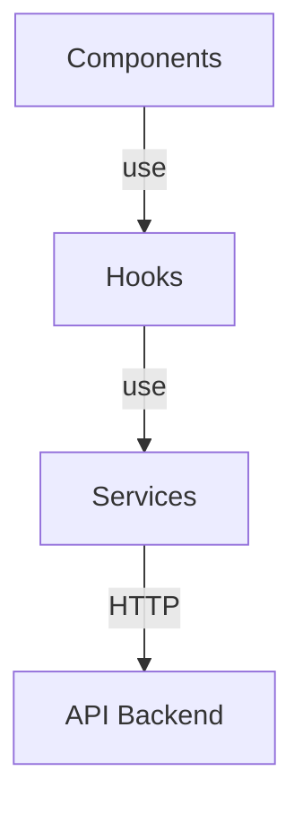
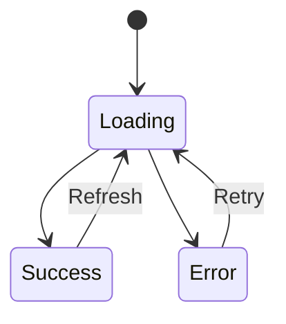

# Architecture de Communication Frontend-Backend

## 1. Principes Architecturaux

### 1.1 Séparation des Responsabilités
- **Backend (FastAPI)**
  - Gestion des données
  - Logique métier
  - API RESTful
  - Validation des données

- **Frontend (React)**
  - Interface utilisateur
  - État de l'application
  - Gestion des interactions
  - Présentation des données

### 1.2 Communication Client-Serveur


## 2. Architecture Frontend en Couches

### 2.1 Service Layer Pattern


#### Avantages
- Séparation claire des responsabilités
- Réutilisabilité du code
- Facilité de test
- Maintenance simplifiée

### 2.2 Custom Hooks Pattern
```typescript
// Schéma conceptuel
const useData = () => {
  const [state, setState] = useState(initial);
  
  useEffect(() => {
    // 1. Appel au service
    // 2. Mise à jour de l'état
    // 3. Gestion des erreurs
  }, [dependencies]);
  
  return { data, loading, error };
};
```

#### Bénéfices
- Encapsulation de la logique
- Gestion d'état standardisée
- Réutilisabilité entre composants
- Séparation des préoccupations

## 3. Gestion des États et du Cycle de Vie

### 3.1 États Possibles


### 3.2 Cycle de Vie des Données
1. **Initialisation**
   - Montage du composant
   - Initialisation des états

2. **Chargement**
   - Affichage du loader
   - Appel API via service

3. **Résolution**
   - Succès : affichage des données
   - Erreur : affichage message

4. **Nettoyage**
   - Démontage du composant
   - Libération des ressources

## 4. Patterns de Communication

### 4.1 Service Layer
```typescript
// Pattern de base
class APIService {
  private baseURL: string;
  
  constructor(baseURL: string) {
    this.baseURL = baseURL;
  }
  
  async get<T>(endpoint: string): Promise<T> {
    const response = await fetch(`${this.baseURL}${endpoint}`);
    if (!response.ok) throw new Error('API Error');
    return response.json();
  }
}
```

### 4.2 Error Boundary Pattern
```typescript
try {
  const data = await service.getData();
  handleSuccess(data);
} catch (error) {
  handleError(error);
} finally {
  setLoading(false);
}
```

## 5. Bonnes Pratiques

### 5.1 Gestion des Configurations
```plaintext
/frontend
  ├── .env.development      # Variables de développement
  ├── .env.production       # Variables de production
  └── src/
      ├── services/         # Couche service
      ├── hooks/           # Hooks personnalisés
      └── components/      # Composants React
```

### 5.2 Typage TypeScript
```typescript
// Types stricts pour la sécurité
interface APIResponse<T> {
  data: T;
  status: number;
  message: string;
}

// Utilisation
const response: APIResponse<GeoJSON> = await api.get('/regions');
```

### 5.3 Gestion des Erreurs
- Erreurs HTTP
- Timeouts
- Erreurs de parsing
- Erreurs réseau
- Validation des données

## 6. Sécurité

### 6.1 CORS
```python
# Backend (FastAPI)
app.add_middleware(
    CORSMiddleware,
    allow_origins=["http://localhost:5173"],
    allow_credentials=True,
    allow_methods=["*"],
    allow_headers=["*"],
)
```

### 6.2 Validation des Données
```typescript
// Frontend
interface GeoFeature {
  type: 'Feature';
  properties: {
    name: string;
    code: string;
    population?: number;
  };
  geometry: GeoJSON.Geometry;
}
```

## 7. Performance

### 7.1 Optimisations
- Mise en cache des réponses
- Debouncing des requêtes
- Lazy loading des composants
- Compression des données

### 7.2 Monitoring
- Logs de requêtes
- Temps de réponse
- Taux d'erreur
- Métriques utilisateur

## 8. Tests

### 8.1 Tests Unitaires
```typescript
describe('RegionsService', () => {
  it('should fetch regions', async () => {
    const regions = await RegionsService.getAll();
    expect(regions).toBeDefined();
  });
});
```

### 8.2 Tests d'Intégration
- Communication API
- Gestion des erreurs
- Cycle de vie des composants
- États de chargement
