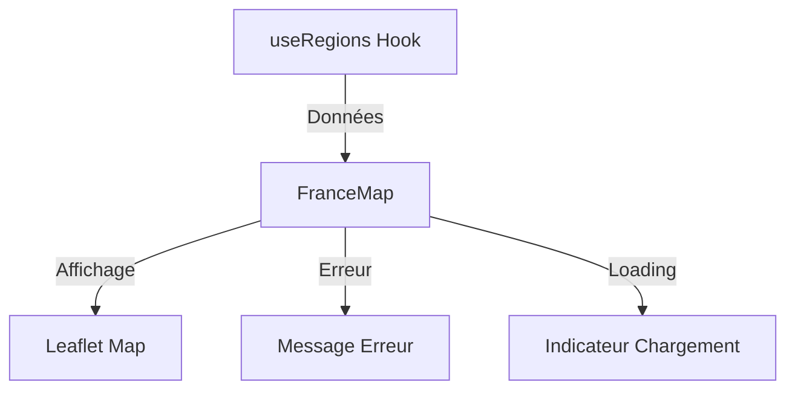

# Explication Détaillée des Fichiers de Connexion Frontend-Backend

## 1. Configuration d'Environnement (`.env.development`)

```bash
VITE_API_URL=http://localhost:8000/api/v1
```

### Explication
- **Pourquoi ce fichier ?** 
  - Sépare la configuration du code
  - Permet différentes URLs selon l'environnement (dev/prod)
  
- **Comment ça marche ?**
  - Vite lit automatiquement ce fichier au démarrage
  - Préfixe `VITE_` requis pour exposer la variable au frontend
  - Accessible via `import.meta.env.VITE_API_URL`

## 2. Service API (`services/api.ts`)

### Rôle du Service
- Point d'entrée unique pour les appels API
- Abstrait la logique de communication HTTP
- Centralise la gestion des erreurs

### Analyse du Code
```typescript
const API_URL = import.meta.env.VITE_API_URL;

export const RegionsService = {
  getAll: async (): Promise<GeoFeatureCollection> => {
    try {
      const response = await fetch(`${API_URL}/regions`);
      if (!response.ok) throw new Error(`HTTP error! status: ${response.status}`);
      return await response.json();
    } catch (error) {
      console.error('Error fetching regions:', error);
      throw error;
    }
  }
};
```

#### Décomposition
1. **Configuration**
   - Utilise l'URL de l'API depuis les variables d'environnement
   - Type de retour explicite avec `Promise<GeoFeatureCollection>`

2. **Gestion des Erreurs**
   - Vérifie si la réponse est OK (`response.ok`)
   - Log les erreurs pour le debugging
   - Propage l'erreur pour la gestion en amont

3. **Parsing des Données**
   - Conversion automatique JSON → TypeScript
   - Typage fort avec l'interface GeoFeatureCollection

## 3. Hook Personnalisé (`hooks/useRegions.ts`)

### Rôle du Hook
- Gère l'état des données des régions
- Encapsule la logique de chargement et d'erreur
- Fournit une interface simple aux composants

### Analyse du Code
```typescript
export const useRegions = () => {
  const [regions, setRegions] = useState<GeoFeatureCollection | null>(null);
  const [loading, setLoading] = useState<boolean>(true);
  const [error, setError] = useState<Error | null>(null);

  useEffect(() => {
    const fetchRegions = async () => {
      try {
        const data = await RegionsService.getAll();
        setRegions(data);
      } catch (err) {
        setError(err instanceof Error ? err : new Error('Failed to fetch regions'));
      } finally {
        setLoading(false);
      }
    };

    fetchRegions();
  }, []);

  return { regions, loading, error };
};
```

#### Décomposition
1. **États Gérés**
   - `regions` : données GeoJSON des régions
   - `loading` : état de chargement
   - `error` : erreurs potentielles

2. **Cycle de Vie**
   - Chargement au montage du composant (`useEffect` avec `[]`)
   - Nettoyage automatique à la destruction

3. **Gestion des États**
   - État initial : loading=true, pas de données
   - Succès : données chargées, loading=false
   - Erreur : message d'erreur, loading=false

## 4. Composant Map (`components/FranceMap.tsx`)

### Rôle du Composant
- Affiche la carte interactive
- Consomme les données via le hook
- Gère les états visuels (chargement/erreur)

### Points Clés d'Implémentation

1. **Utilisation du Hook**
```typescript
const { regions, loading, error } = useRegions();
```
- Récupère les données et états en une ligne
- Pattern de déstructuration pour clarté

2. **Gestion des États Visuels**
- Affiche un loader pendant le chargement
- Montre les erreurs de manière utilisateur-friendly
- Transition fluide vers l'affichage des données

3. **Interaction avec Leaflet**
- Initialisation de la carte au montage
- Ajout des données GeoJSON quand disponibles
- Gestion des événements (hover, click)

4. **Nettoyage des Ressources**
- Suppression de la carte au démontage
- Évite les fuites mémoire

### Flux de Données


## Avantages de cette Architecture

1. **Séparation des Responsabilités**
   - Service : communication API
   - Hook : gestion d'état
   - Composant : affichage

2. **Maintenabilité**
   - Code modulaire
   - Points de modification uniques
   - Tests facilités

3. **Réutilisabilité**
   - Hook utilisable dans d'autres composants
   - Service API centralisé
   - États standardisés

4. **Performance**
   - Chargement optimisé
   - Mises à jour ciblées
   - Nettoyage automatique
